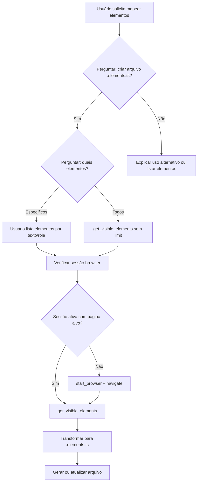

# Mapear Elementos via WDIO MCP

## Overview

Orientar o agente a usar o MCP WebDriverIO (`get_visible_elements`) para obter elementos da tela e gerar arquivos `[pagina].elements.ts` automaticamente, seguindo o padrão Oracle-Driven Dialogue.

**REQUIRED:** Para estrutura e regras do arquivo gerado, use create-elements.

## Quando usar

- Usuário pede para mapear elementos da tela automaticamente
- Criar `.elements.ts` a partir da página atual no browser
- Descobrir elementos interativos com seletores prontos

## Fluxo obrigatório



## Perguntas obrigatórias

| Pergunta | Opções | Propósito |
|----------|--------|-----------|
| É para criar o arquivo de elements? | Sim / Não | Confirmar geração de `.elements.ts` |
| Quais elementos mapear? | Específicos (lista) / Todos | Filtrar ou mapear todos |
| URL da página (se sessão inexistente)? | URL | Iniciar browser e navegar |
| Nome da página/arquivo? | Ex: `login`, `signup` | Caminho: `pages/[pagina]/[pagina].elements.ts` |

## Execução MCP

### Servidor

Usar `call_mcp_tool` com servidor `wdio-mcp` (ou `project-0-triade.estruturas-book.typescript-wdio-mcp` se escopo de projeto).

### 1. Garantir sessão browser

Se não houver sessão com a página carregada:

- `start_browser`: `{ "navigationUrl": "URL", "browser": "chrome" }`
- Ou `start_browser` + `navigate`: `{ "url": "URL" }`

### 2. Obter elementos

```text
get_visible_elements
```

- `inViewportOnly`: true (padrão)
- `limit`: 0 (todos) ou N se paginação
- `offset`: para paginação
- Resposta: `{ total, showing, hasMore, elements: [...] }`
- Cada elemento: `tagName`, `type`, `id`, `className`, `textContent`, `value`, `placeholder`, `href`, `ariaLabel`, `role`, `cssSelector`

Se usuário escolheu "específicos", filtrar `elements` por `textContent`, `ariaLabel`, `role` ou `placeholder` conforme a lista.

### 3. Transformar para .elements.ts

Mapeamento tipo → prefixo (create-elements):

| Tipo (role/tagName/type) | Prefixo | Exemplo |
|--------------------------|---------|---------|
| button, submit | `btn` | `btnLogin` |
| textbox, text, email, search | `input` | `inputEmail` |
| checkbox | `check` | `checkMr` |
| link | `link` | `linkHome` |
| Outros | descritivo | `labelWelcome` |

Para cada elemento:

1. Gerar nome do getter (ex: `inputEmail`, `btnSubmit`)
2. Usar `cssSelector`; preferir seletor com `data-qa` se o elemento tiver
3. JSDoc: `/** Mapeamento do [descrição] do [contexto da página] */`
4. Formato: `get nomeElemento() { return $("seletor"); }`

### 4. Arquivo de destino

`pages/[dominio]/[pagina]/[pagina].elements.ts` ou `pages/base/[componente]/[componente].elements.ts`

## Exemplo de transformação

Entrada MCP (resumido):

```json
{ "tagName": "input", "type": "email", "placeholder": "Email", "cssSelector": "[data-qa=\"login-email\"]" }
```

Saída:

```typescript
/**
 * Mapeamento do campo 'Email' do login
 */
get inputEmail() { return $('[data-qa="login-email"]'); }
```

## Integração

- **create-elements**: Define estrutura, nomenclatura e regras do arquivo
- **map-elements-wdio-mcp**: Automatiza a descoberta via MCP; o output segue create-elements

## Common Mistakes

- Esquecer de perguntar se é para criar e quais elementos
- Não garantir sessão browser antes de chamar get_visible_elements
- Usar seletor frágil quando `data-qa` estiver disponível no elemento
