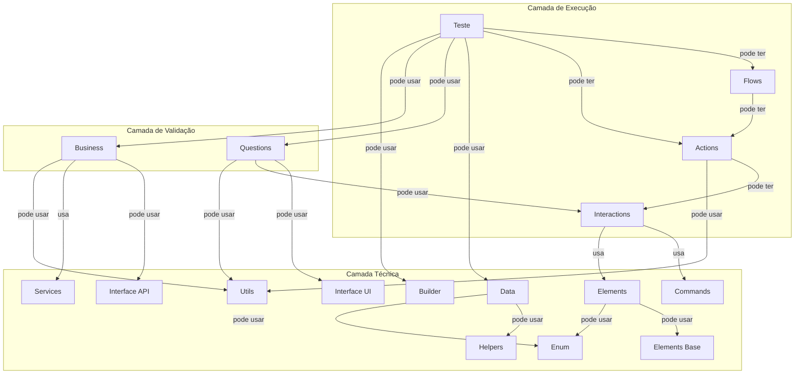

# Oracle-Driven Dialogue Pattern

Projeto de automação E2E com **WebdriverIO**, organizado no **Oracle-Driven Dialogue Pattern (ODDP)**: camadas de página (`pages`), orquestração em `flows`, validação em **Questions** (UI) e **Business** (API), além de relatórios **Allure**.

## O que é o Oracle-Driven Dialogue Pattern (ODDP)

- **Origem e escopo:** padrão criado por **Jonatas Martins** entre **2023 e 2024**, a partir de um projeto real de automação mobile em forte crescimento; **também se aplica à automação web** (como neste repositório).
- **Influências:** traz ideias do **Screenplay Pattern** e do **Page Component Objects (PCOM)** — não é fusão literal, e sim **abstração seletiva** dos dois, combinada para escalabilidade e manutenção.
- **Significado do nome:** *Diálogo* é a automação em execução; *Guiado* indica que ela é conduzida por **oráculos**; *Oráculo* são as camadas que formalizam **perguntas ao SUT** — em especial **Questions** (UI) e **Business** (API).
- **Conceito central:** a **verdade do teste** está na **regra de negócio**, não só na interface: a UI é o **meio** do diálogo; quem define o correto é o negócio. O teste age como **investigador**: **Actions** e **Flows** são os *movimentos* no ambiente; **Questions** e **Business** são as *perguntas* que revelam se o sistema está certo.
- **Práticas:** tipagem consistente (evitar dados fora do padrão); **design patterns** para robustez e menos duplicação; **documentação precisa dos métodos** — útil para manutenção e para **ferramentas de IA** que apoiam a criação de novos testes.

Padrão documentado por Jonatas Martins (2023–2024).

## Conceitos neste repositório

- **`flows/` e o padrão Facade:** os fluxos expõem uma API simples de orquestração por cima de várias **Actions** e páginas — um ponto de entrada que simplifica o uso dos subsistemas de página.
- **Oráculos (duas fontes de verdade para asserts):**
  - **Questions** (`*.questions.ts` em `pages/`) — oráculo da **interface** (web ou app): estado visível, textos, elementos exibidos.
  - **Business** (`*.business.ts` em `core-api`) — oráculo da **API**: validação via serviços (por exemplo, dados conferidos no backend após uma ação na UI).

## Arquitetura



## Estrutura de pastas

| **Pasta**      | **Descrição / Função**                                                                                                                                      |
|----------------|-------------------------------------------------------------------------------------------------------------------------------------------------------------|
| `config/`      | Configurações do WebdriverIO por navegador (`chrome`, `firefox`, `edge`) e `wdio.conf.ts` base.                                                             |
| `core-api/`    | Camada de API (Pactum): `service`, **business** (oráculo API), `builder`, `interface`, `utils`. Veja detalhes em [core-api/README.md](core-api/README.md).  |
| `core-web/`    | Comandos customizados do WDIO (`commands/`) e constantes web. Mais informações em [core-web/README.md](core-web/README.md).                                 |
| `data/`        | Dados de teste organizados por feature/cenário (`ctNN`, `paramsDefault`, textos esperados).                                                                 |
| `enum/`        | Enumeradores para evitar uso de magic strings.                                                                                                              |
| `flows/`       | Fluxos de usuário no padrão **Facade**: orquestram diversas Actions/páginas, oferecendo um ponto de entrada simplificado.                                   |
| `interface/`   | Contratos TypeScript para UI/dados (exceto os definidos em `core-api`).                                                                                     |
| `pages/`       | `*.elements`, `*.interactions`, `*.actions`, `*.questions` (oráculo web/app) e componentes reutilizáveis em `base/`.                                        |
| `reports/`     | Saída dos relatórios Allure (gerados pela execução dos testes automatizados).                                                                               |
| `tests/`       | Casos de teste `CT-NN.test.ts` organizados por feature.                                                                                                     |
| `.cursor/`     | Regras (`.mdc`), skills, comandos e MCP. Saiba mais em [.cursor/README.md](.cursor/README.md).                                                              |

Na **raiz** do projeto: `package.json` (scripts de teste e relatório), `constants.ts` (Actions, Questions, Flows, Business, etc.) e `tsconfig.json`.

- [Board com os Casos de testes](https://github.com/users/qajonatasmartins/projects/9)

## Inicialização do projeto

As pastas `core-api/` e `core-web/` são **submódulos Git** (definidos no `.gitmodules` na raiz do repositório do livro). Sem inicializá-los, o código-fonte dessas dependências não fica disponível.

1. **Clonar com submódulos** (recomendado na primeira vez):

   ```bash
   git clone --recurse-submodules <url-do-repositório>
   ```

2. **Ou**, se o repositório já foi clonado sem submódulos, na **raiz do repositório do livro** execute:

   ```bash
   git submodule update --init --recursive
   ```

3. **Instalar dependências** na pasta deste capítulo:

   ```bash
   cd chapter-4/1.oracleDrivenDialoguePattern
   npm install
   ```

4. **Variáveis de ambiente:** copie [`.env.example`](.env.example) para `.env` e ajuste os valores (veja também a seção [Como executar](#como-executar)).

5. **Relatório Allure:** após rodar os testes (que gravam resultados em `reports/local/...`), abra o relatório com `npm run report:chrome` ou os scripts `report:firefox` / `report:edge` descritos abaixo.

## Como executar

Com submódulos e dependências já instalados ([inicialização](#inicialização-do-projeto)), defina as variáveis de ambiente (há [`.env.example`](.env.example) como referência). Entre outras, o projeto usa `URL`, `API_URL`, `TEST_EMAIL`, `TEST_PASSWORD` e `TEST_CASE_URL`.

```bash
npm install
npm run test:chrome
# ou: npm run test:firefox | npm run test:edge
```

Relatórios Allure (após gerar resultados em `reports/`):

```bash
npm run report:chrome
# ou: npm run report:firefox | npm run report:edge
```

## Skills Cursor (`.cursor/skills/`)

Cada skill orienta a criação de um tipo de artefato no ODDP. Use-as no chat do Cursor ao pedir novos arquivos ou ao seguir o fluxo do comando `/create-test`.

| **Skill**                     | **Descrição / Função**                                                                                                          |
|-------------------------------|---------------------------------------------------------------------------------------------------------------------------------|
| `create-actions`              | Gera `.actions.ts` para ações de alto nível que orquestram interactions.                                                        |
| `create-base`                 | Cria `.base.ts` para componentes base reutilizáveis (seletores compartilhados).                                                 |
| `create-builder`              | Cria `.builder.ts` para Builders (uso de faker, métodos `with*`).                                                               |
| `create-business`             | Cria `.business.ts` para validação via API (oráculo de backend).                                                                |
| `create-commands`             | Cria `.commands.ts` para custom commands WebdriverIO (ex.: wait + click/set).                                                   |
| `create-constants`            | Atualiza ou cria `constants.ts` (Actions, Questions, Flows, Business etc.).                                                     |
| `create-data`                 | Cria `.data.ts` para dados de cenário (`ctNN`, `paramsDefault`, textos esperados).                                              |
| `create-elements`             | Cria `.elements.ts` para mapeamento de elementos; combine com `map-elements-wdio-mcp` para descoberta automatizada na tela.     |
| `create-enum`                 | Cria `.enum.ts` para valores fixos reutilizáveis.                                                                               |
| `create-flows`                | Cria `.flows.ts` para fluxos que orquestram Actions de várias páginas.                                                          |
| `create-interactions`         | Cria `.interactions.ts` para interações de baixo nível (elements + commands).                                                   |
| `create-interface`            | Cria `.interface.ts` para contratos de dados / DTOs.                                                                            |
| `create-questions`            | Cria `.questions.ts` para validações de UI (oráculos de página).                                                                |
| `create-service`              | Cria `.service.ts` para chamadas HTTP com Pactum.                                                                               |
| `create-test`                 | Cria `.test.ts` para casos CT-NN (AAA, Allure, oracles).                                                                        |
| `create-utils`                | Cria `.utils.ts` para utilitários da `core-api` (ex.: preSetup).                                                                |
| `map-elements-wdio-mcp`       | Mapeia elementos da tela via MCP WebDriverIO e gera/atualiza `.elements.ts` (estrutura compatível com `create-elements`).       |

Agrupamento por tema:

- **UI / página:** create-elements, map-elements-wdio-mcp, create-interactions, create-actions, create-questions, create-base, create-commands
- **Orquestração e testes:** create-flows, create-test, create-data, create-constants
- **API / tipos:** create-service, create-business, create-builder, create-interface, create-enum, create-utils

Mais detalhes sobre regras por arquivo e comandos `/`: [.cursor/README.md](.cursor/README.md).
